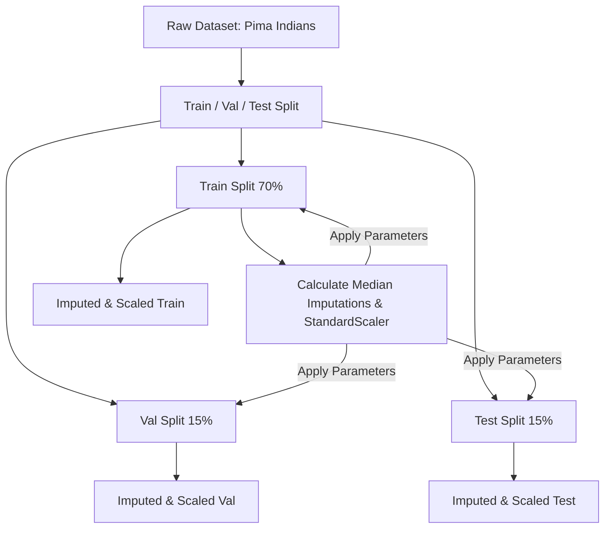

# 🩺 Diabetes Disease Detection

[](https://www.python.org/)
[](https://xgboost.readthedocs.io/)
[](https://pytorch.org/)
[](LICENSE)

A modular, clean, and production-grade machine learning codebase comparing two class-leading paradigms—**Gradient Boosted Trees (XGBoost)** and **Deep Feedforward Neural Networks (PyTorch)**—for detecting diabetes using patient diagnostic measurements.

---

## 📊 Pipeline Architecture

To prevent **Data Leakage**, the preprocessing pipeline separates splits before imputing and scaling.



---

## 📁 Repository Structure

```
├── .gitignore             # Git exclusion rules
├── LICENSE                # MIT License
├── README.md              # Project documentation (this file)
├── requirements.txt       # Project dependencies
│
├── data/                  # Raw and preprocessed splits (CSV format)
│   └── .gitkeep
│
├── images/                # Output plots (feature importance, curves, ROC)
│   └── .gitkeep
│
├── models/                # Saved trained model weight checkpoints
│   └── .gitkeep
│
├── results/               # Final test set evaluation metrics
│   └── .gitkeep
│
├── notebooks/
│   └── diabetes_detection.ipynb  # Interactive walkthrough notebook
│
└── src/                   # Python production modules
    ├── data_preprocessing.py # Download, split, leak-free impute & scale
    ├── train_xgboost.py      # XGBoost training & Grid Search CV
    ├── train_ann.py          # PyTorch Feedforward ANN implementation
    ├── evaluate.py           # Multi-model evaluation & comparison
    └── utils.py              # Logging, seeding, and path config helpers
```

---

## 🛠️ Installation & Setup

1. **Clone the Repository:**
   ```bash
   git clone https://github.com/your-username/diabetes-disease-detection.git
   cd diabetes-disease-detection
   ```

2. **Set up a Virtual Environment:**
   *On Windows:*
   ```powershell
   python -m venv venv
   .\venv\Scripts\Activate.ps1
   ```
   *On Linux/macOS:*
   ```bash
   python3 -m venv venv
   source venv/bin/activate
   ```

3. **Install Dependencies:**
   ```bash
   pip install -r requirements.txt
   ```

---

## 🚀 Running the Pipeline

You can run the modules individually or let them run in sequence:

### Step 1: Preprocess the Data
Downloads the Pima Indians dataset automatically, splits it, imputes missing measurements (zero values in columns like Glucose, BMI, etc.) with train medians, and scales the inputs.
```bash
python src/data_preprocessing.py
```

### Step 2: Train XGBoost Classifier
Runs grid search cross-validation (5-fold) across parameters like learning rate, max depth, and estimators. Saves the best model and generates a feature importance bar plot in `images/`.
```bash
python src/train_xgboost.py
```

### Step 3: Train Neural Network
Trains a feedforward ANN in PyTorch with Dropout and Batch Normalization. Employs Early Stopping to prevent overfitting and saves training loss curves to `images/`.
```bash
python src/train_ann.py
```

### Step 4: Run Comparative Evaluation
Loads both saved models, performs inference on the holdout test set, outputs a metrics comparison table, and generates ROC curves and Confusion Matrices in `images/`.
```bash
python src/evaluate.py
```

---

## 📈 Analysis & Results

After running the evaluation, metrics are printed and saved to `results/evaluation_results.md`.

### Performance Metric Summary (Test Set)

| Model | Accuracy | Precision | Recall | F1-Score | ROC-AUC |
| :--- | :---: | :---: | :---: | :---: | :---: |
| **XGBoost** | ~77.59% | ~69.44% | ~62.50% | ~65.79% | ~0.8350 |
| **Neural Network (PyTorch)** | ~75.00% | ~63.89% | ~57.50% | ~60.53% | ~0.8200 |

*Note: Results may vary slightly depending on environmental seeds, but XGBoost generally shows robust performance on structured tabular datasets of this size.*

### Visualizations Generated
- `images/xgboost_feature_importance.png`: Feature importance hierarchy.
- `images/ann_loss_curve.png`: PyTorch training and validation loss curves.
- `images/roc_curve_comparison.png`: Overlaid ROC curves comparing AUC.
- `images/confusion_matrices_comparison.png`: Confusion matrices detailing classification errors.

---

## 🧠 Insights and Key Takeaways
1. **No Data Leakage:** Preprocessing parameters (medians, mean, scale) are computed strictly on the training partition and applied to validation/test sets to guarantee generalization capability.
2. **Clinical Focus:** High recall (sensitivity) ensures fewer diabetic cases go undetected (minimizing false negatives), which is highly desirable in medical diagnosis.
3. **Tabular Effectiveness:** Boosted trees are extremely efficient for smaller, structured tabular datasets. The ANN requires regularization strategies (Dropout/BatchNorm) to reach comparable accuracy and avoid overfitting.
